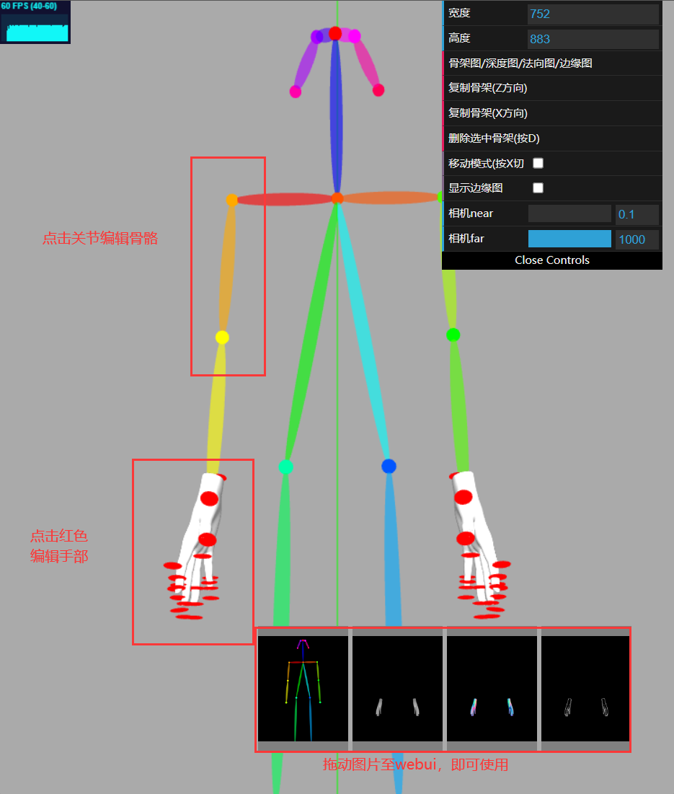

# openpose 编辑器
# [打开链接，即可食用](https://zhuyu1997.github.io/open-pose-editor/)（https://zhuyu1997.github.io/open-pose-editor/ ）
# 功能预览

# 功能
- openpose骨架图
- 深度图
- 法向图
- 边缘图
- 手部姿态编辑
# 交流
个人QQ:891085309

[bug/feature反馈交流群](https://jq.qq.com/?_wv=1027&k=N6j4nigd)：272950545